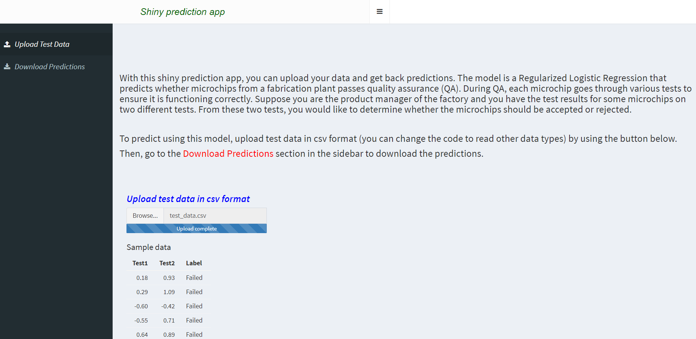
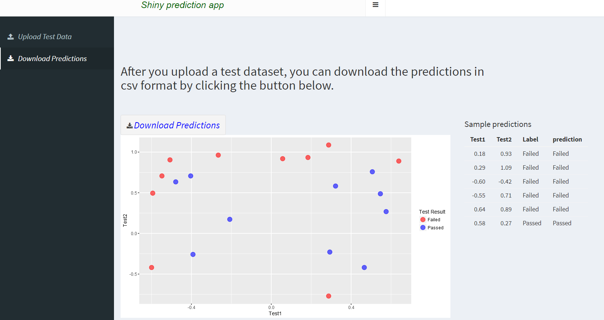

# R_Shiny_Machine_Learning
Shows how to use Shiny to demo your machine learning model or to submit Machine Learning Challenges. 
Shiny is a good way to demo your machine learning model or to submit your machine learning challenge so 
that others can quickly upload test data and get amazed by your nice model. 
 We will build a regularized logistic regression model.
 
 
 
 
